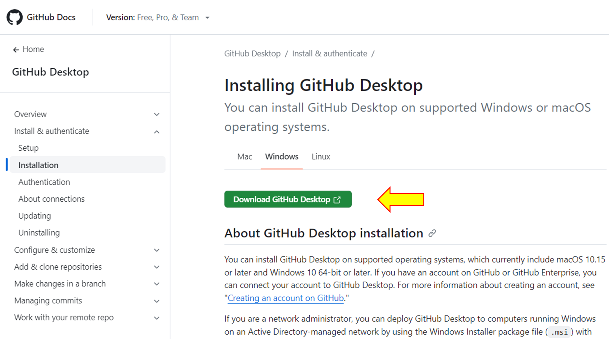
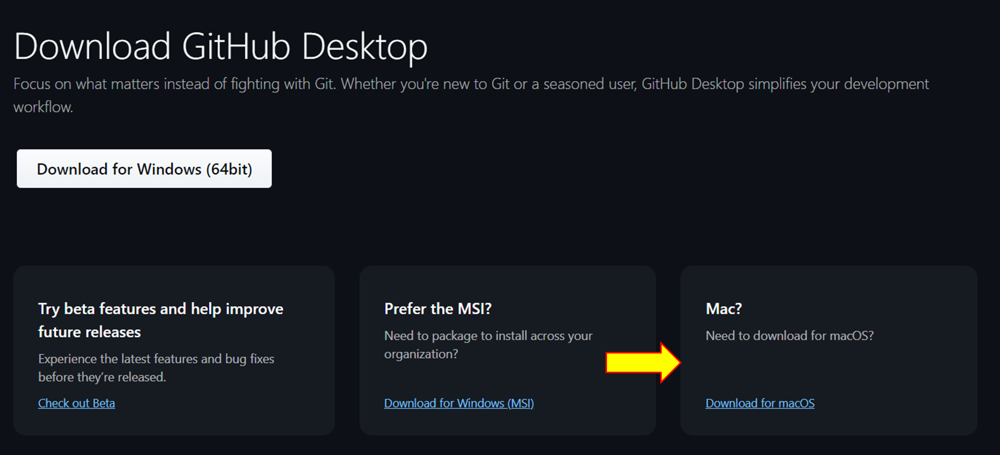

# การใช้ github desktop ในการทำงานร่วมกับ repository

## สิ่งที่ต้องเตรียม

โปรแกรม github desktop

## เป้าหมายที่จะทำในวันนี้

ใช้โปรแกรม github desktop ในการทำงานกับ repository และ branch

## การทดลอง

### 1. ติดตั้งโปรแกรม github desktop

#### 1.1 Browse ไปที่หน้า document ของ github desktop

[github desktop](https://docs.github.com/desktop) อ่านและทำความเข้าใจเอกสาร

#### 1.2  ดำเนินการตาม document ในหัวข้อ [Install & authentication](https://docs.github.com/en/desktop/installing-and-authenticating-to-github-desktop/setting-up-github-desktop)

 เมื่อคลิกลิ้งค์จะ redirect มายังหน้า download ซึ่งโดยเริ่มต้นจะให้ download สำหรับผู้ใช้ Windows

สำหรับผู้ที่ใช้ macOS สามารถรับโปรแกรมได้ที่ลิ้งค์ดังรูป

ซึ่งจะได้ไฟล์มาในนามสกุล .zip สามารถนำไปติดตั้งใช้งานบนเครื่อง macOS ได้

ผู้ใช้ Linux ubuntu สามารถดำเนินการติดตั้งได้ตามแนวทางในลิงค์ด้านล่างนี้

https://gist.github.com/berkorbay/6feda478a00b0432d13f1fc0a50467f1

หรือ

https://github.com/kontr0x/github-desktop-install

## [>> การใช้งานโปรแกรม github desktop ทำงานพื้นฐาน >>](W12-Labsheet-02.md)
