# การทดลอง

## 2. การใช้งานโปรแกรม github desktop ทำงานพื้นฐาน

### 2.1 การ clone repository จาก github 

#### 1. สร้าง repository ขึ้นมาใน account ตนเอง 

#### 2. ให้ fork repo มาจาก https://github.com/Computer-Lab-1/github-demo มาไว้ใน account ของตนเอง


#### 3. Clone จาก remote (origin) บน github.com มายัง local repository

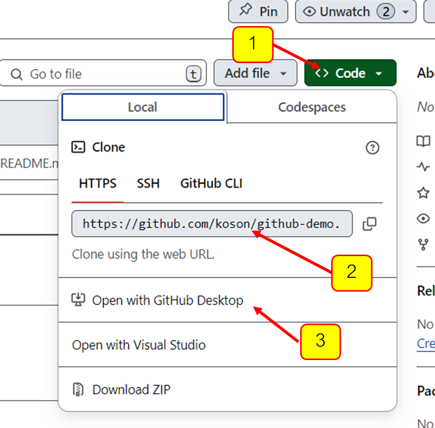
 
(1) คลิกที่ปุ่ม code (สีเขียว)

(2) ตรวจสอบชื่อ repo

(3) คลิกที่  Open with Github Desktop

#### 3. ระบบจะพามาที่โปรแกรม github desktop เพื่อเลือกที่ตั้งของ Local repository

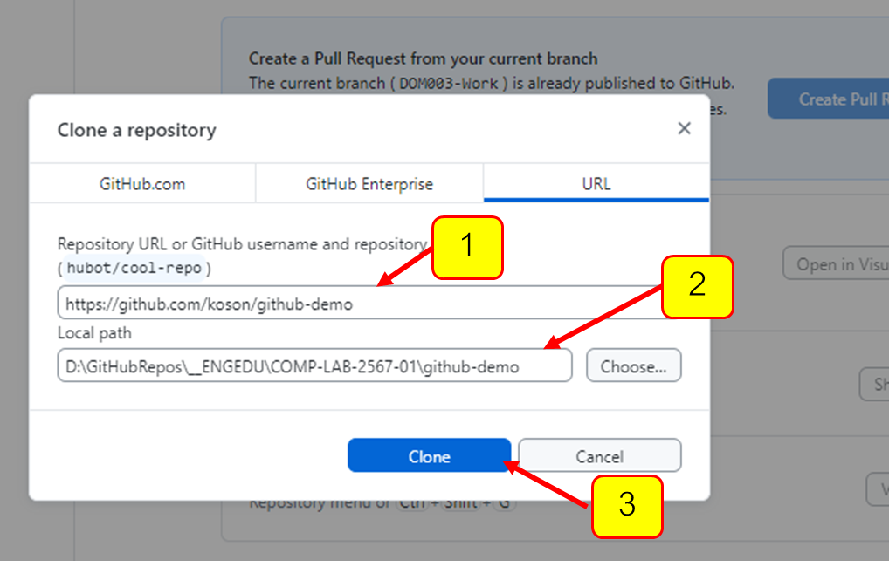

เลือกวิธีการ clone จาก URL

(1) ใช้ url ตามที่โปรแกรมใส่ให้โดยอัตโนมัติ (มาจาก github.com)

(2) เลือกที่ตั้งบน harddisk โดยต้องไม่มีชื่อ  path เป็นอักขระต้องห้าม (เช่นตัวอักษรที่ไม่ใช่ภาษาอังกฤษ)

ควรมีเฉพาะอักษรภาษาอังกฤษและไม่มีช่องว่างใน path

(3) กด clone

#### 4. ตรวจสอบผลการ clone

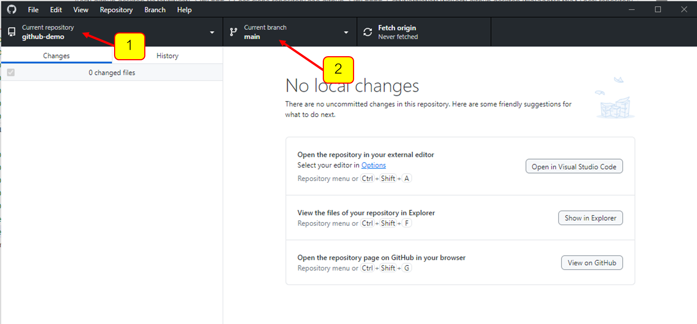

(1) ชื่อของ repository ต้องตรงกับบน remote repository บน github.com

(2) Branch ปัจจุบันคือ main

สังเกตว่าหน้าต่างด้านขวาของ github desktop  จะรายงานว่าปัจจุบันยังไม่มีการเปลี่ยนแปลงใดๆ ของเนื้อหาใน  ไนพารืเ directory 

#### 5. ตรวจสอบประวัติการ commit

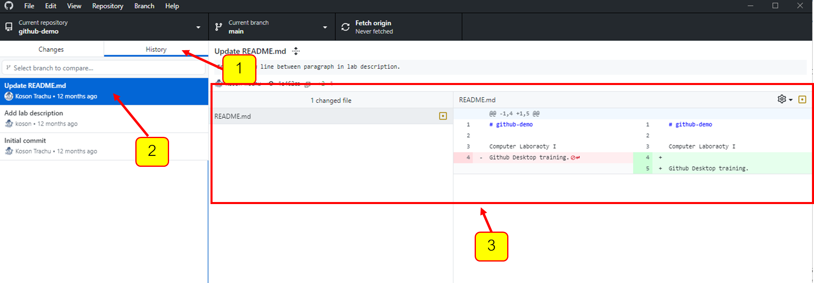

(1) คลิกที่ history

(2) ตรวจสอบประวัติการ commit

(3) เปรียบเทียบรุ่นเก่าและใหม่ของไฟล์ที่ถูกแก้

- Initial commit คือชื่อของ commit แรกของ repository ที่ถูกสร้างโดย github.com

- ในตัวอย่างนี้มีเพียงไฟล์ README.md ถ้ามีหลายไฟล์ ให้เลือกจากรายการไฟล์ใน pane ด้านซ้ายของหน้า

#### 6. ทดลองแก้ไขไฟล์ใน working directory

คลิกเมนู Repository -> Show in Explorer ดังภาพต่อไปนี้

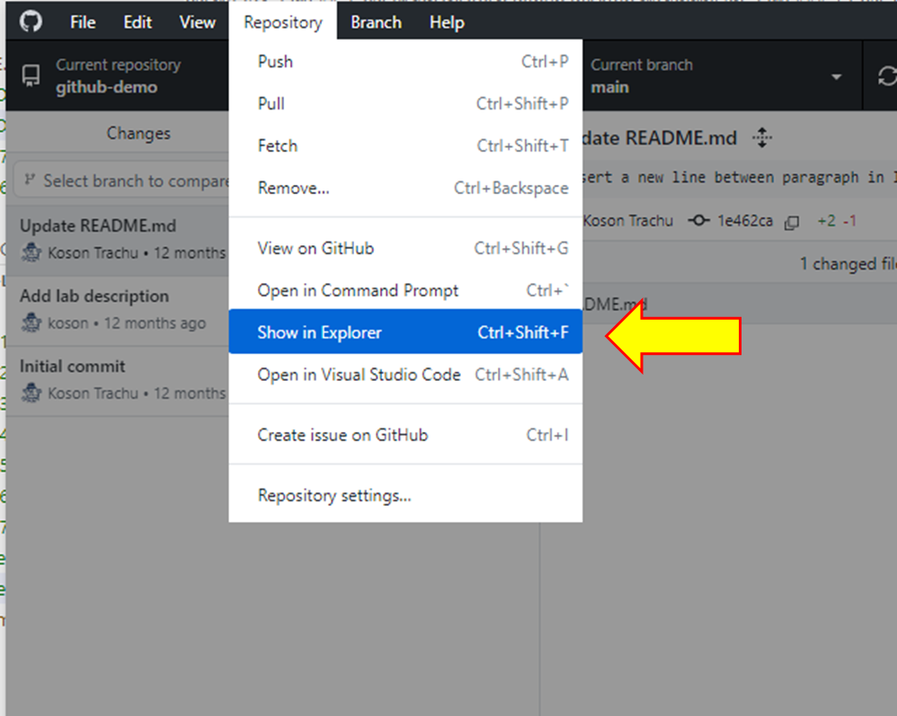

#### 7. Github desktop จะเปิด folder ของ  working directory ขึั้นมาใน file explorer

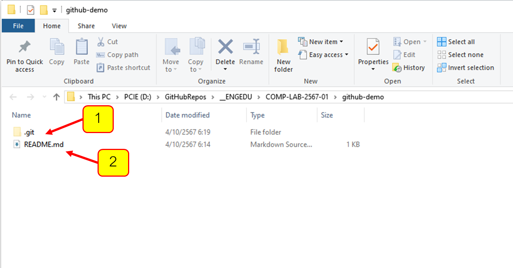

##### หมายเหตุ 
ถ้าไม่เห็นโฟลเดอร์ .git  ให้แสดงโฟลเดอร์ทั้งหมดตามขั้นตอนต่อไปนี้

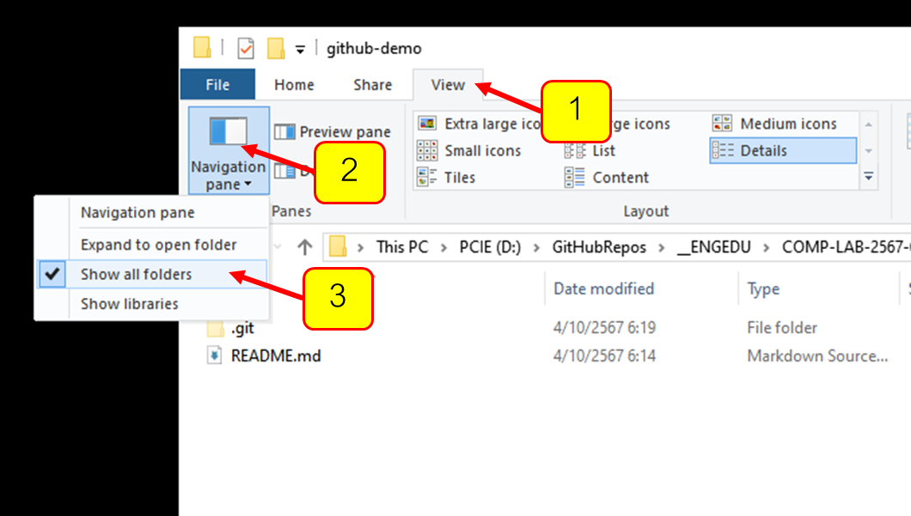

(1) .git คือที่อยู่ของ local repository ห้ามแก้ไขหรือลบ folder นี้ มิฉะนั้นอาจจะไม่สามารถรักษาประวัติการแก้ไขไฟล์ได้

(2) ให้เปืดไฟล์ README.md ด้วย text editor (ในตัวอย่างใช้โปรแกรม notepad.exe ซึ่งมีมากับ Windows ทุกรุ่น)

#### 8. เพิ่มเติมเนื้อหาของไฟล์ใน README.md

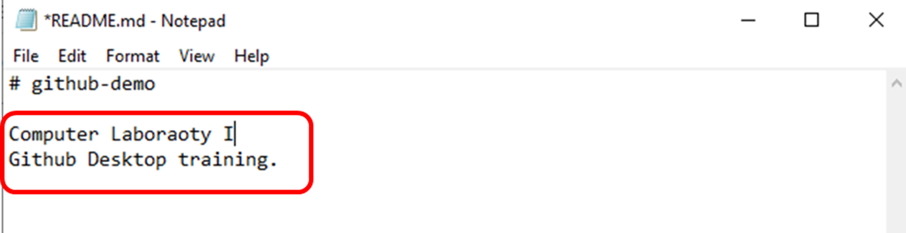

ใส่ข้อความจำนวน 2 บรรทัด ลงใน README.md

บันทึกไฟล์ README.md

#### 9. กลับไปที่โปนแกรม github desktop เพื่อตรวจสอบการเปลี่ยนแปลงที่เกิดขึ้น

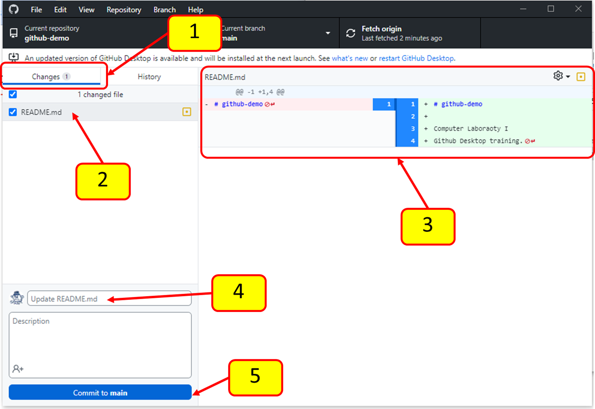

(1) คลิกที่ Changes

(2) คลิกที่ README.md

(3) ตรวจสอบการเปลี่ยนแปลงของ README.md ว่าตรงกับที่เราแก้ไขไปหรือไม่ ถ้าไม่ตรง อาจจะเกิดจากที่ยังไม่ได้บันทึกไฟล์

(4) ใส่ข้อความ commit ถ้าไม่ใส่ โปรแกรม github desktop จะเสนอตามที่ปรากฏในภาพ

(5) คลิก Commit to main

#### 10. push การเปลี่ยนแปลงขึ้นบน server (remote repository)
 
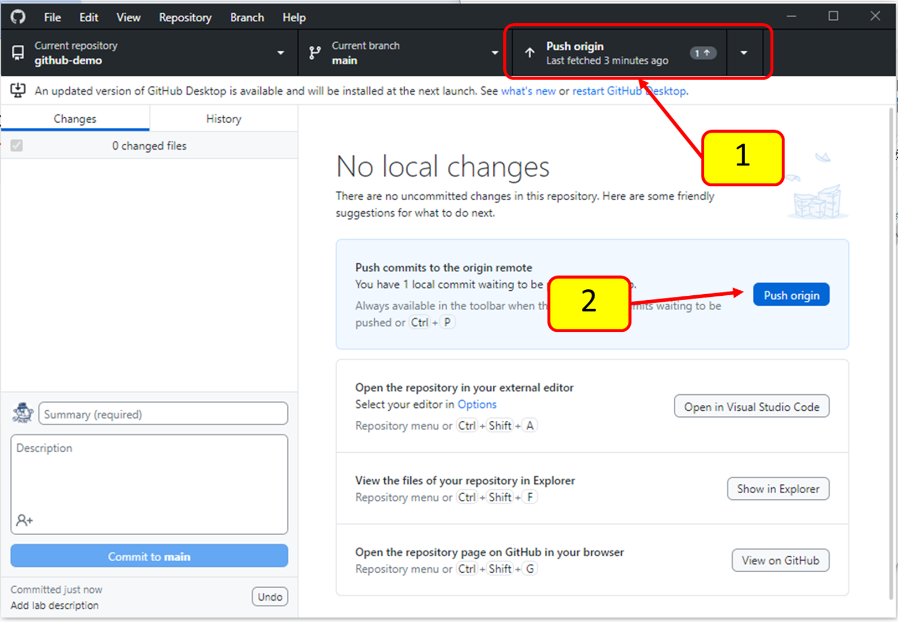

(1)  ตรวจสอบจำนวนการ commit ที่เกิดขึ้น (ยังไม่ได่ push)

(2)  คลิก Push origin เพื่อ push ไปยัง origin repository ใน github.com

#### 11. ตรวจสอบสถานะใน github desktop 


เทียบได้กับข้อความต่อไปนี้เมื่อใช้คำสั่ง git status ใน git bash

``` md
Your branch is up to date with 'origin/main'.

nothing to commit, working tree clean
```

#### 12. กลับไปตรวจสอบสถานะใน github repository web page

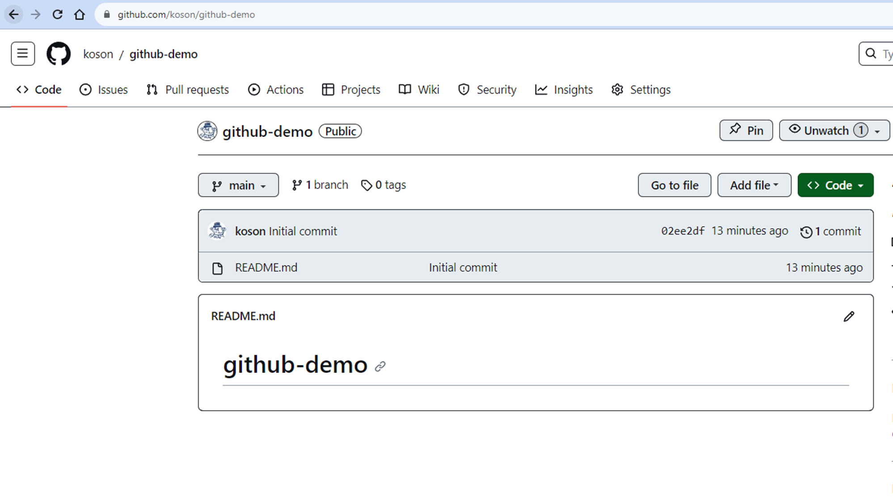

#### 13. กด refresh 1 ครั้ง เพื่อดูการเปลี่ยนแปลง

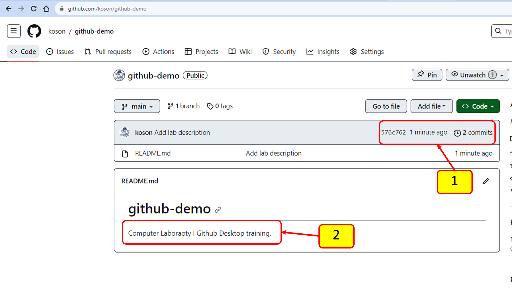


(1) ให้คลิกที่ 2 Commits แล้วจดรหัสการ commit ที่เป็นเลขฐาน 16 ไว้ทั้งสอง commit

(2) สังเกตุว่าข้อความจะไม่แบ่งบรรทัด เนื่องจากหลักการเขียน markdown จะต้องเคาะเว้นว่าง 1 บรรทัด หรือใส่อักขระช่องว่าง (space bar)  สองตัวที่ท้ายบรรทัด เพื่อบอกให้ github markdown parser รู้ว่าต้องการเว้นบรรทัด (เราจะแก้เนื้อหานี้ในลำดับถัดไป)

#### 14. ตรวจสอบความสอดคล้องต้องกันระหว่าง local และ remote repository


กลับไปที่ github desktop ให้คลิกที่รายการ commit ต่างๆ แล้วบันทึกชื่อ พร้อมรัสฐาน 16  เปรียบเทียบว่าตรงกับบน web browser หรือไม่ อย่างไร

#### 15. แก้ไขไฟล์ README.md (บน web browser) ให้แสดงผลได้อย่างถูกต้อง

1 ) คลิกที่ปุ่มดินสอ เพื่อแก้ไขไฟล์ README.md

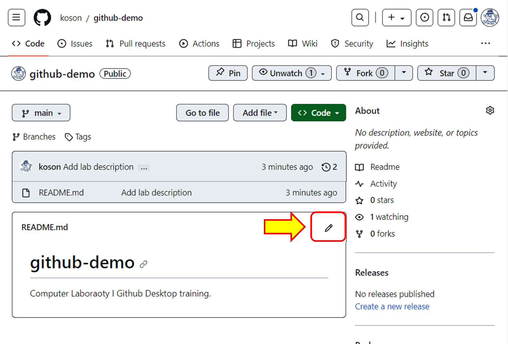


2 )  github จะเปิดหน้าต่างการแก้ไขดังรูป

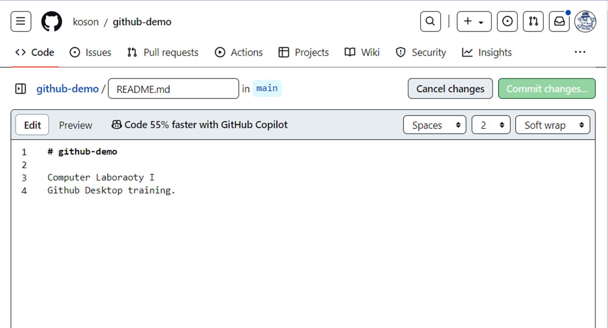


3 )  กดปุ่ม Preview เพื่อแสดงตัวอย่างผลลัพธ์ที่จะได้

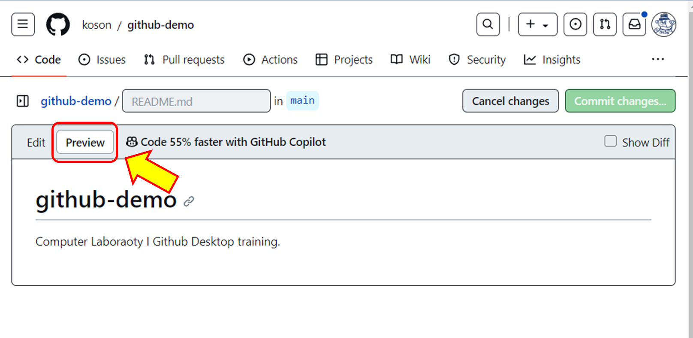


4 )  คลิกกลับมาที่ Edit แล้วเพิ่มบรรทัดว่าง 1 ระหว่างบรรทัดที่ 4 และ 5

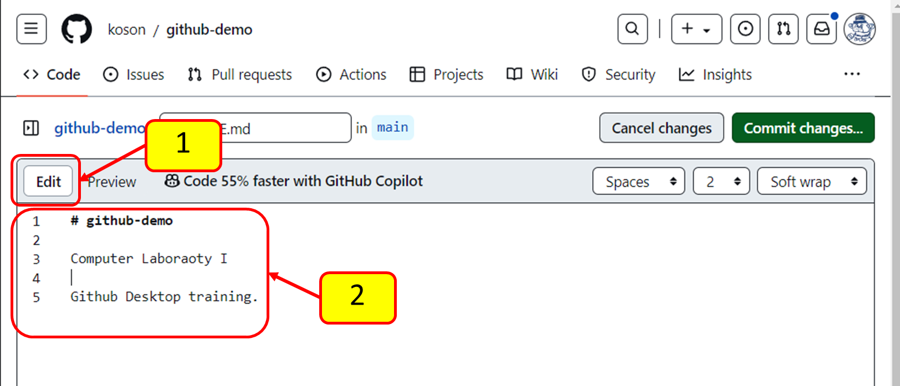


5 )  กดปุ่ม Preview เพื่อแสดงตัวอย่างผลลัพธ์ที่ได้

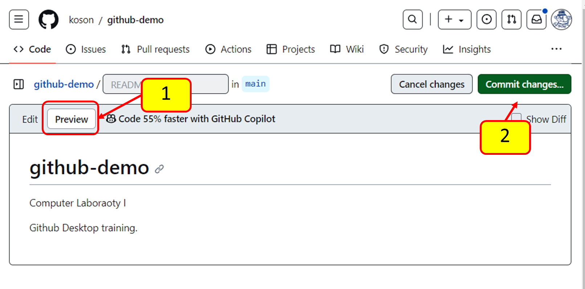


เมื่อได้ผลตามต้องการ ให้ commit change  

6 )  ใส่ข้อความ commit และกด commit change

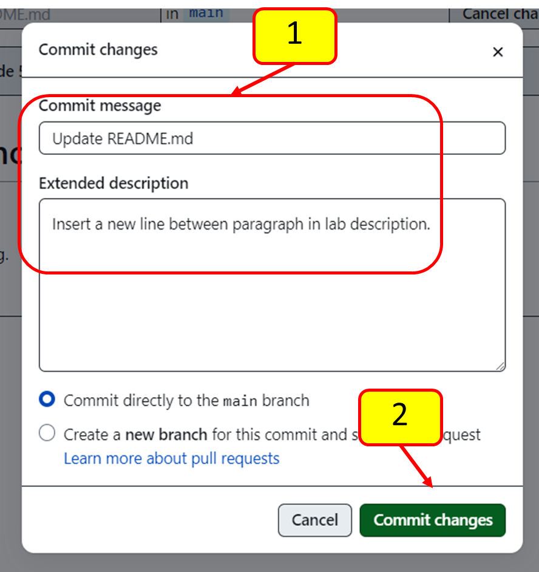

 

7 )  ตรวจสอบและจดบันทึกประวัติการ commit เพื่อไว้เทียบกับ github desktop

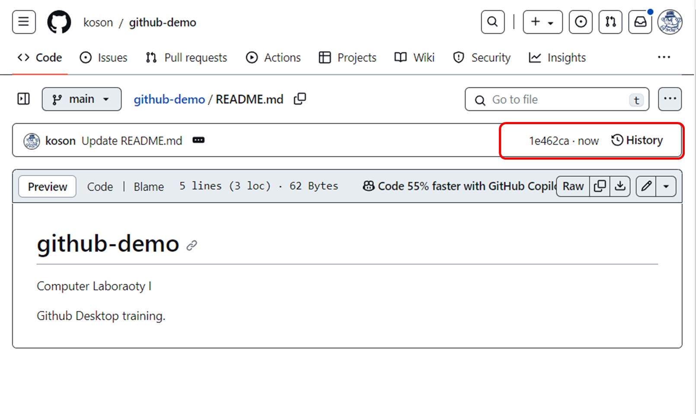


#### 16. ตรวจสอบและทำ git pull ที่ github desktop

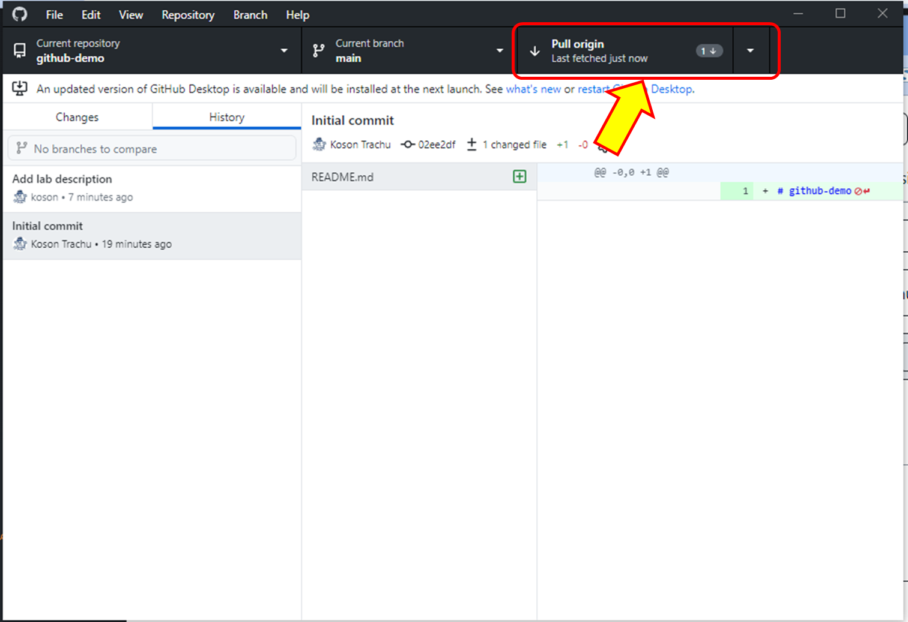


คลิก Pull origin เพื่อดึงการเปลี่ยนแปลงบน remote มาที่ local repository

#### 17. ตรวจสอบประวัติการ commit ที่บน github desktop เทียบกับที่บน  server

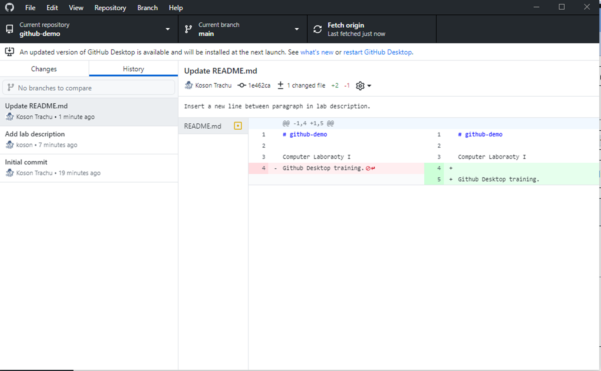


ตรวจสอบให้ครบทั้งชื่อการ commit และ hash code (เลขฐาน 16) ของแต่ละ commit ว่าตรงกันหรือไม่ (เทียบกันเป็นตาราง markdown)

#### 18. ตรวจสอบการเปลี่ยนแปลงในไฟล์ README.md โดนการเปิดใน text editor

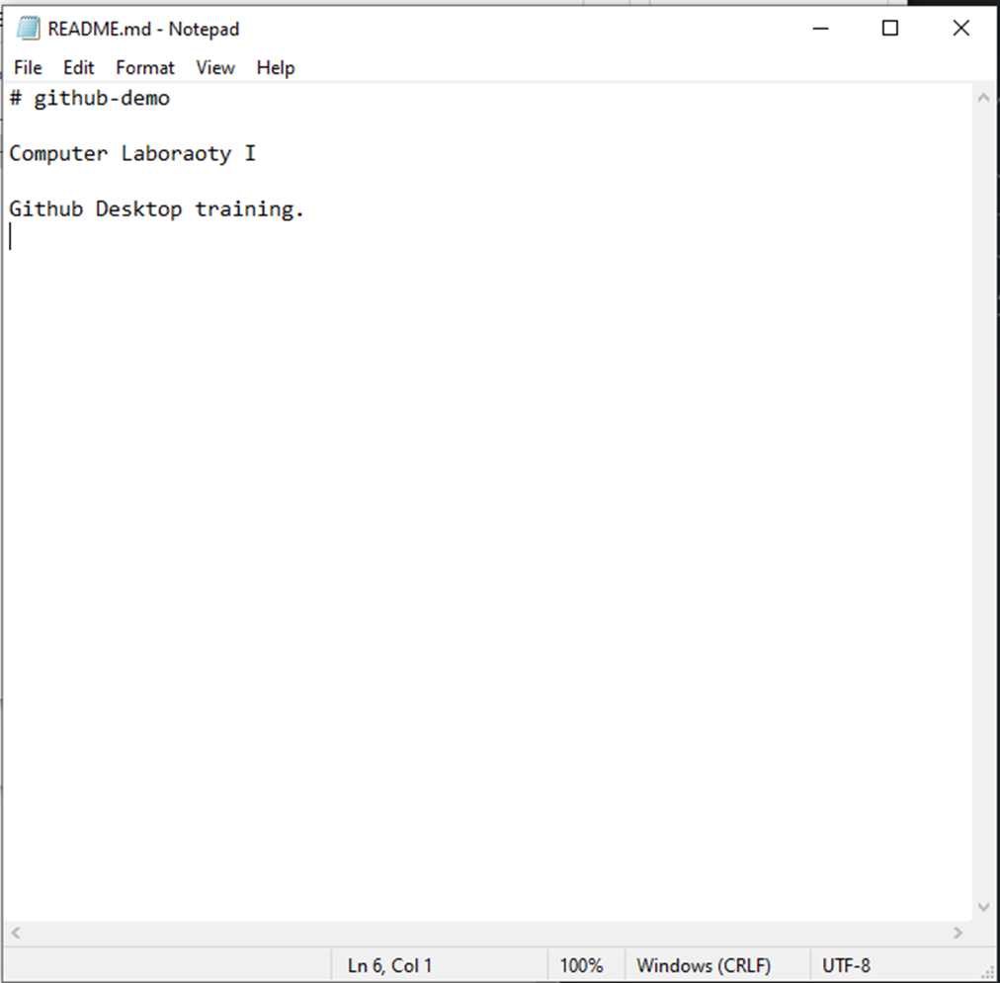


## [>> การสร้าง branch ด้วย github desktop >>](Github_Desktop_Sheet_3.md)