# การทดลอง

## 2. การใช้งานโปรแกรม github desktop ทำงานพื้นฐาน

### 2.2 การสร้าง branch ด้วย github desktop

#### 1. การสร้าง branch ด้วย github desktop

1 ) ในการสร้าง branch (หรือเปลี่ยน branch ในกรณีที่มีอยู่แล้ว) เราสามารถคลิกที่ปุ่ม Current branch ดังรูป

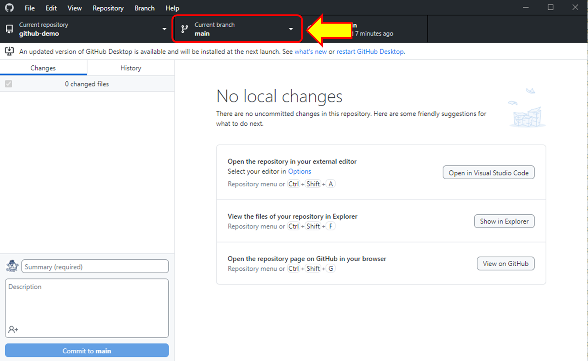

2 ) เมื่อคลิกแล้ว จะมี drop down ขนาดใหญ่ เพื่อให้เราเลือกทำอย่างใดอย่างหนึ่ง ซึ่งในกรณีนี้เราจะสร้าง branch ใหม่

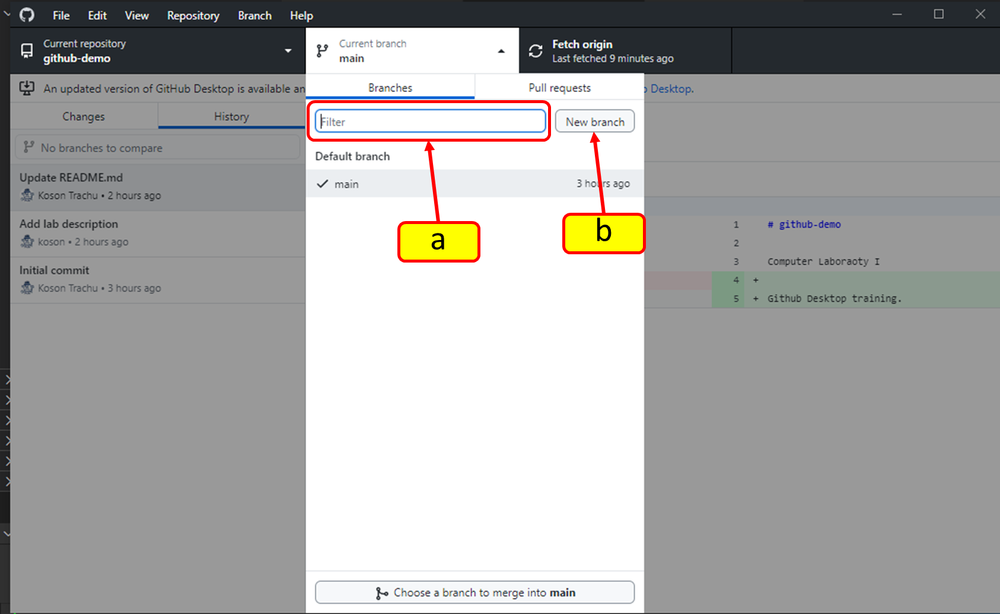

จากรูป เราสามารถเลือกวิธีสร้างได้ 2 รูปแบบ

(a)  โดยการใส่ชื่อ branch ที่ต้องการลงในช่อง text box

(b) โดยการกดปุ่ม New Branch

ทั้งสองกรณีให้ผลที่แตกต่างกัน กรณี (a) นั้นเราจะได้เห็นว่าใน repository ปัจจุบัน มี branch ตรงตามชื่อที่เราจะสร้างใหม่อยู่แล้วหรือไม่ ซึ่งในกรณี (b) จะไม่มีการแสดงชื่อ branch เดิมที่มีอยู่

3 ) ให้ใส่ชื่อ branch ลงในช่อง (a)

กำหนดให้ชื่อ branch มีรูปแบบเป็น `DEV-<Student ID>` ดังตัวอย่างในรูป

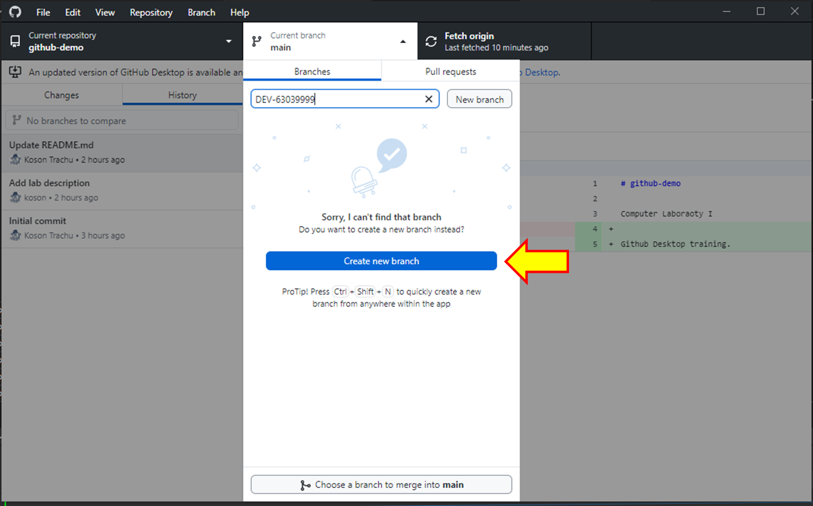

4 ) ยืนยันโดยการกด Create branch

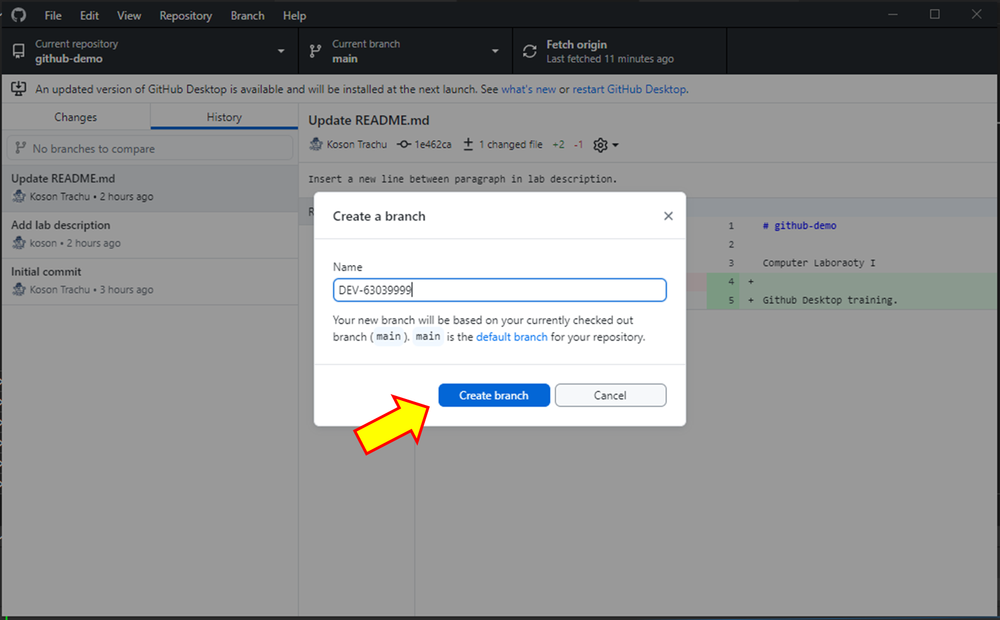

#### 2. Publish brach ขึ้นไปยัง github server

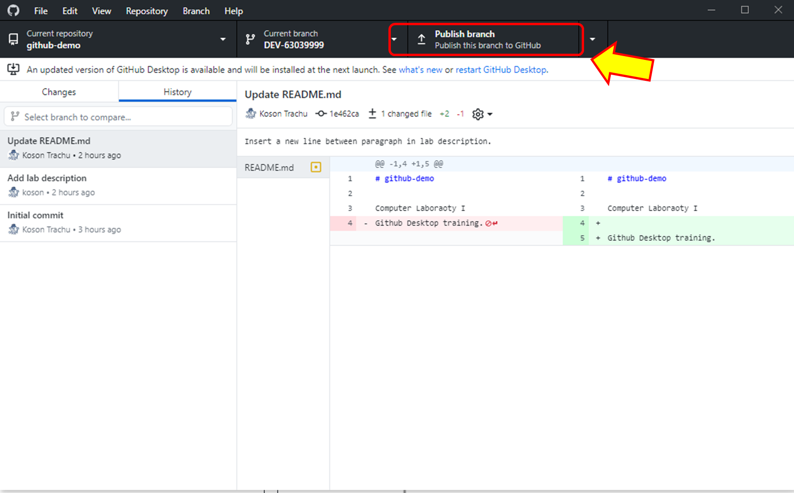

คลิกที่ publish branch

#### 3. ตรวจสอบ และย้าย branch บน github server

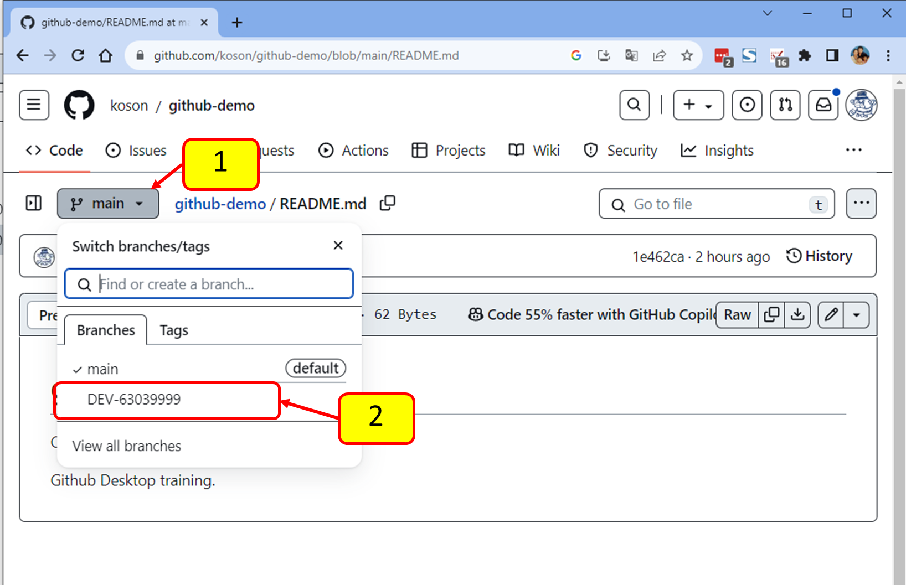

Refresh browser  หนึ่งครั้ง

(1) คลิกที่ชื่อ Branch ซึ่งปัจจุบันแสดงเป็น main

(2) คลิกที่ชื่อ Branch

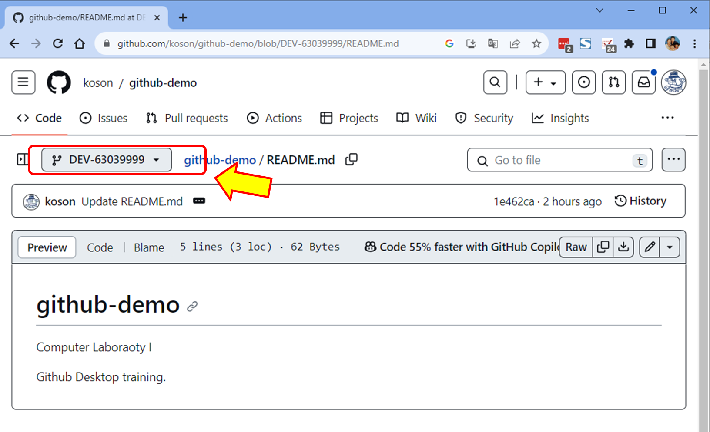

ขั้นตอนต่าง ๆ ในการทำงานกับ branch บน github.com ก็จะเหมือนกับที่เคยทำการทดลองไปแล้วในครั้งก่อน ๆ

#### 4. เพิ่มเนื้อหาใน Branch ที่สร้างขึ้นบน Working directory

1 )  กลับไปที่ github desktop  คลิกที่เมนู Repository -> Show in Explorer

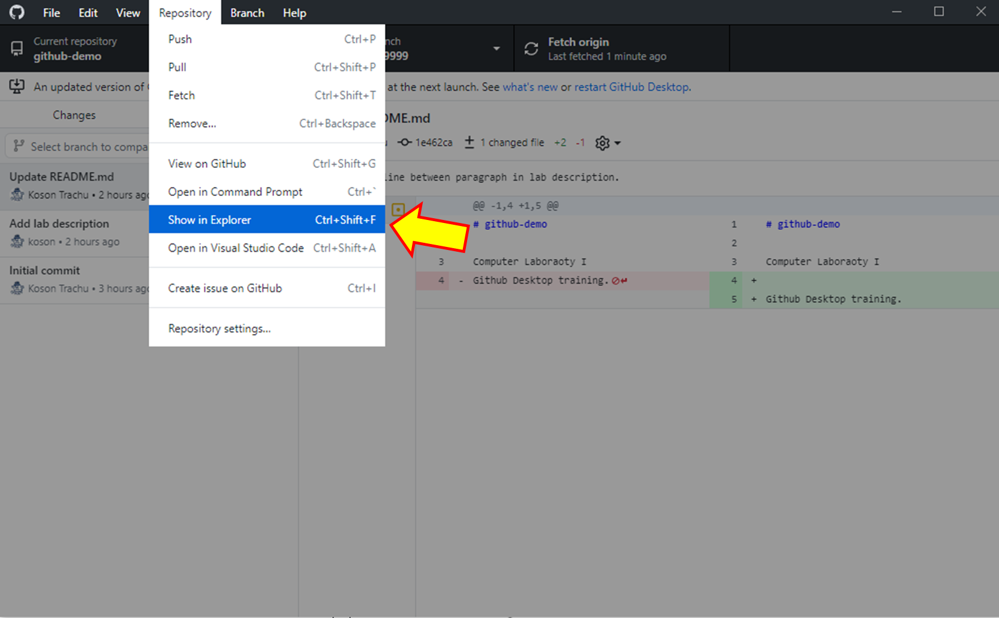

2 )  github desktop  จะเปิด file explorer ขึ้นมา ให้สร้าง folder ย่อยตามรหัสนักศึกษา เสร็จแล้วจะมีหน้าตาคล้ายดังตัวอย่าง 

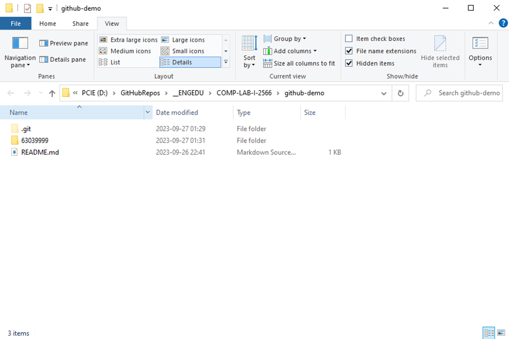

3 ) เข้าไปในโฟลเดอร์ที่สร้างขึ้นใหม่ ให้สร้างไฟล์ html ที่มีเนื้อหาเป็น resume สำหรับสมัครงาน โดยอาจจะแสดงข้อมูลสำคัญต่อไปนี้

- ประวัติการศึกษา

- ประสบการณ์ในการฝึกงานหรือได้รับประกาศนียบัตร

- ตำแหน่งงานที่ต้องการจะทำ

- ความสามามรถด้าน software

- ถ้ามีไฟล์ภาพ เสียง หรือเนื้อหาอื่นใดนอกจากข้อความ ให้ตรวจสอบว่าสามารถใช้งานได้

- สามารถใช้ style sheet หรือ script ได้ และควรแยกเป็นไฟล์ต่างหาก

#### 5. ตรวจสอบไฟล์ที่เปลี่ยนแปลง commit เข้าไปยัง local repository

(1) เลือกไฟล์ที่จะ commit

(2) เขียน commit message

(3) commit change

#### 6. ส่งการเปลี่ยนแปลงบน local ไปยัง remote repository

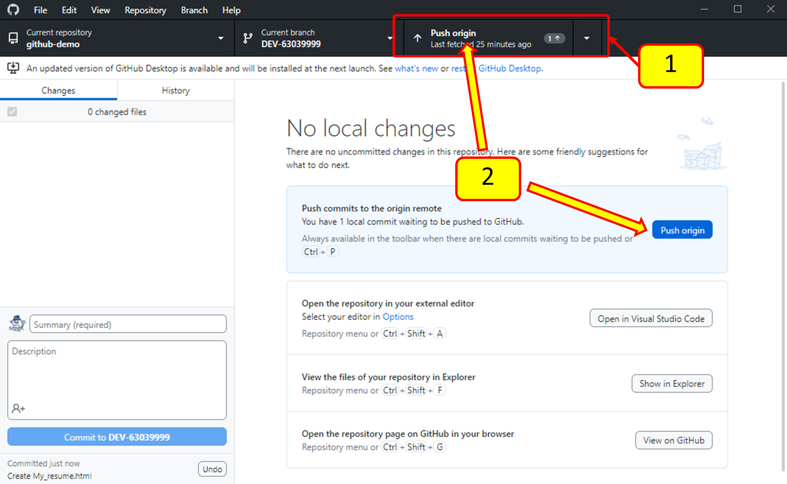

(1) ตรวจสอบจำนวน commit ที่ได้ทำลงไป

(2) Push ไปยัง origin (สามารถกดได้ทั้งสองที่ ให้ผลเหมือนกัน)

เมื่อ push เสร็จ github desktop จะเสนอให้เราทำการ pull  request ซึ่งตอนนี้ยังไม่ต้องทำ 

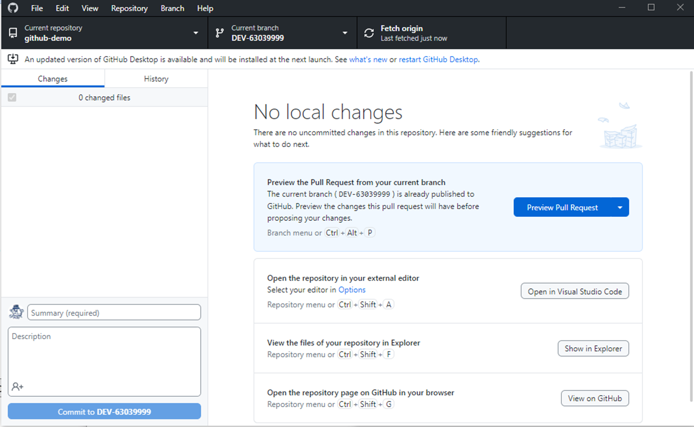

#### 7. ไปตรวจสอบการเปลี่ยนแปลงบน server  

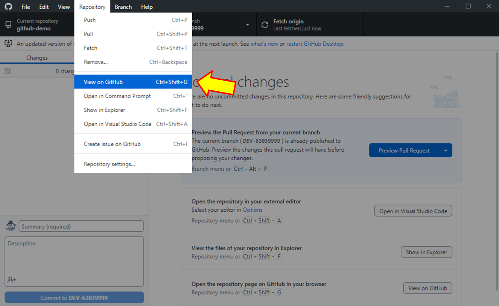

เมื่อคลิกแล้ว github desktop จะส่งไปยัง github.com ใน repository ปัจจุบัน

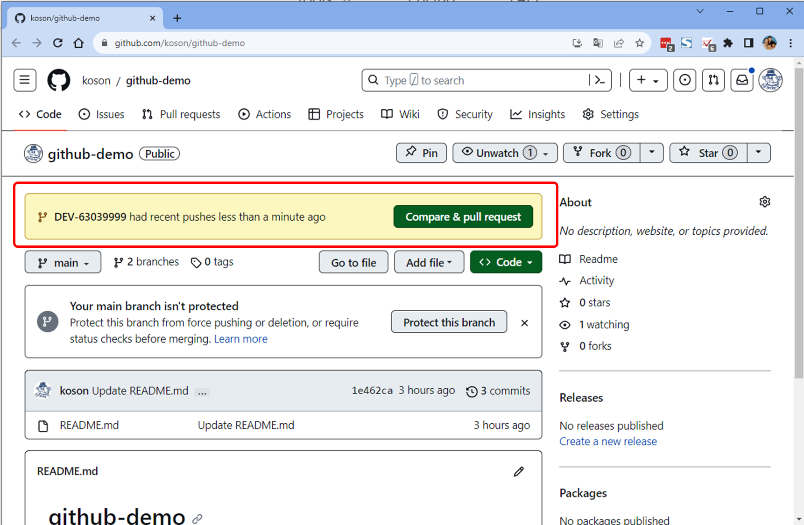

#### 8. ย้าย branch เพื่อตรวจสอบไฟล์ว่ามีอยู่จริงบน github.com

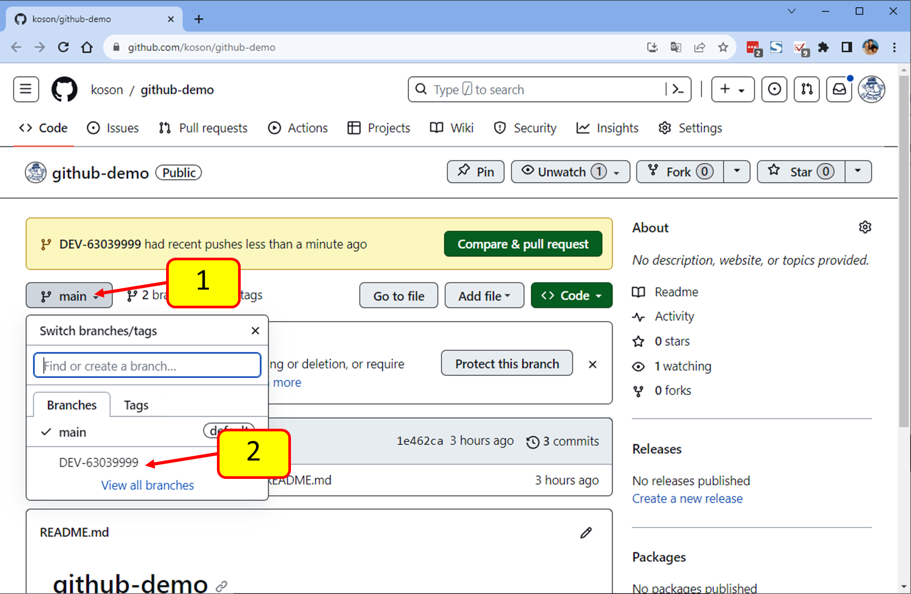

(1) คลิกที่ปุ่มชื่อ branch

(2) เลือกชื่อ  branch ที่ทำงานบน local repository

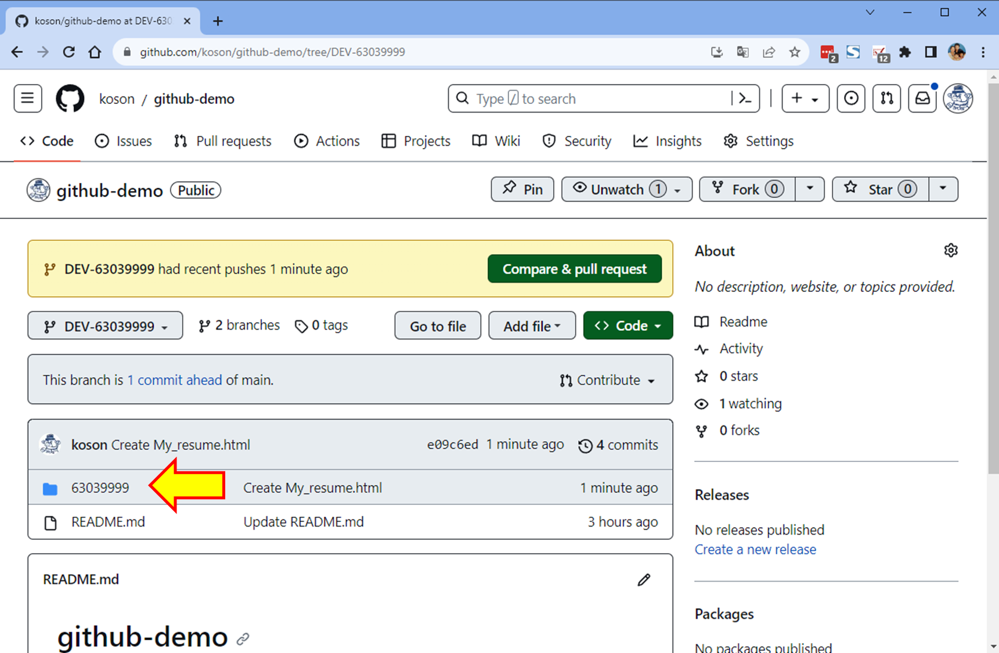

เมื่อเข้ามาใน branch แล้ว ให้เข้าไปดูใน folder ที่สร้างขึ้น ควรจะพบไฟล์ resume ที่สร้างขึ้นทั้งหมด

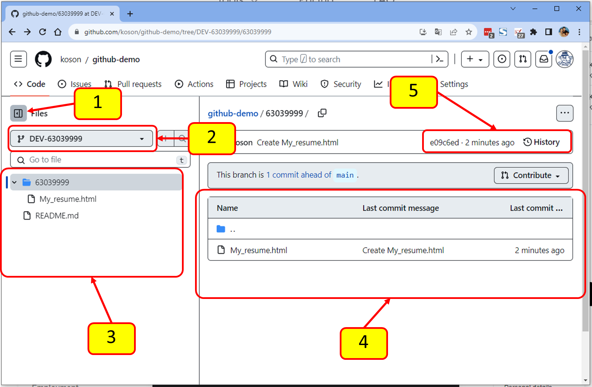

(1) ปุ่มสำหรับแสดงหรือซ่อน folder tree

(2) ปุ่มเลือก branch 

(3) พื้นที่แสดงรายการไฟล์ (folder tree) ซึ่งจะขึ้นอยู่กับ branch ปัจจุบัน

ให้ทดลองสลับไปที่ branch main และสังเกตุการเปลี่ยนแปลง

(4) พื้นที่แสดงไฟล์ เมื่อคลิกเข้าไปจะเห็นประวัติการแก้ไขไฟล์ตามที่ได้ commit ไว้

(5) ประวัติการแก้ไขไฟล์ต่าง ๆ  

#### 9. การทำ Pull request

ขั้นตอนในการทำ Pull request ก็จะมีลำดับเดียวกับที่เคยทำการทดลองไปแล้ว 

ถึงแม้จะมีเมนูให้ทำ pull request ที่ในโปรแกรม github desktop แต่ในทางปฏิบัตแล้ว โปรแกรมก็จะส่งต่อการทำงานมาที่บน web browser เพียงที่เดียว

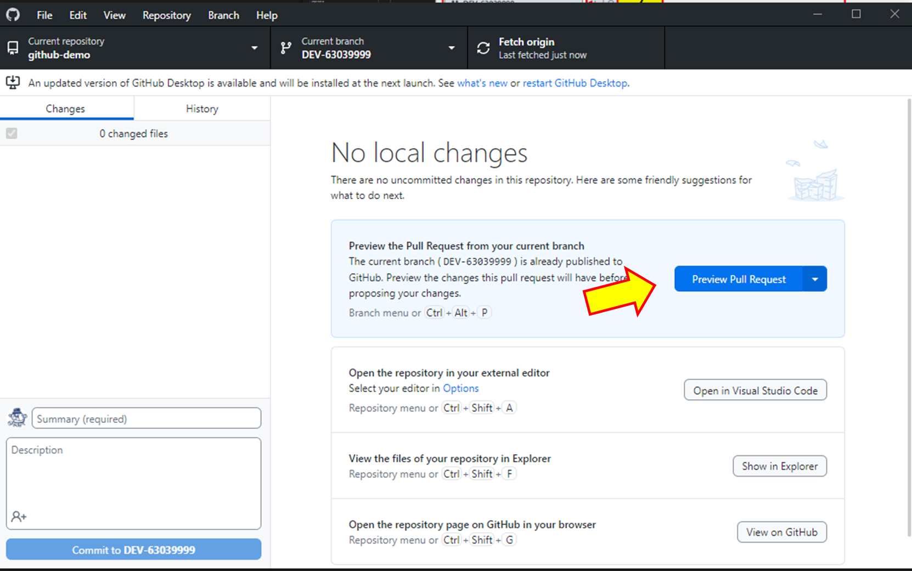

ใน github desktop ให้เลือก branch ที่จะทำ pull request แล้วคลิก Preview Pull request

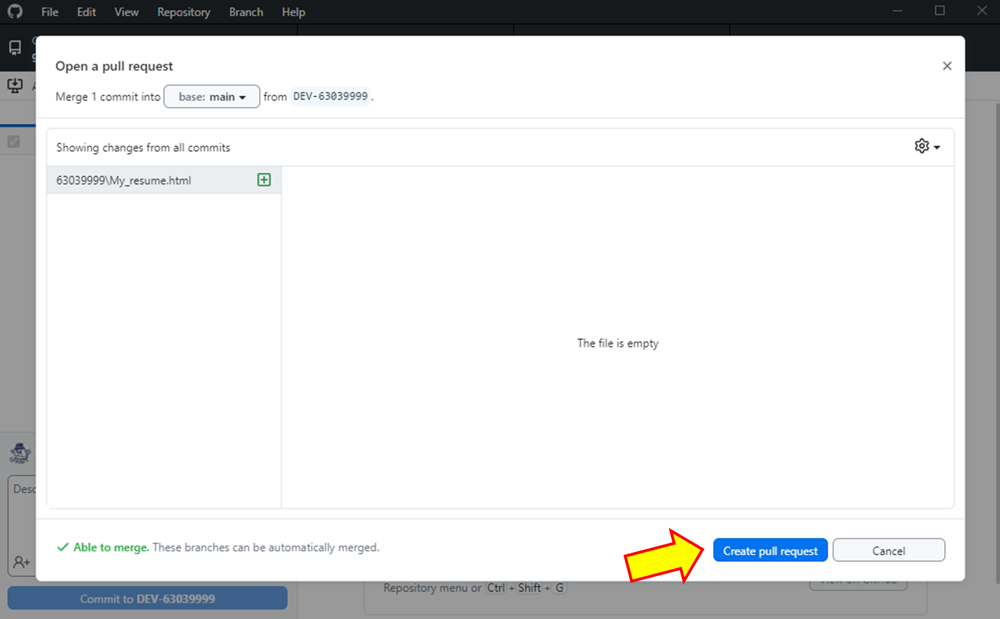

ตรวจสอบรายละเอียดที่จะทำ Pull request แล้วคลิก Create Pull Request

github desktop จะส่งต่อการทำงานไปทำบน web browser